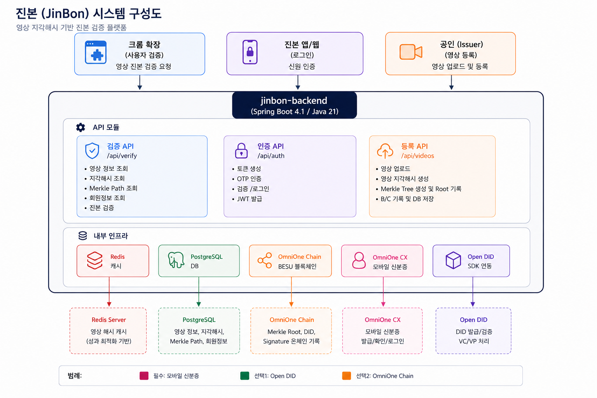
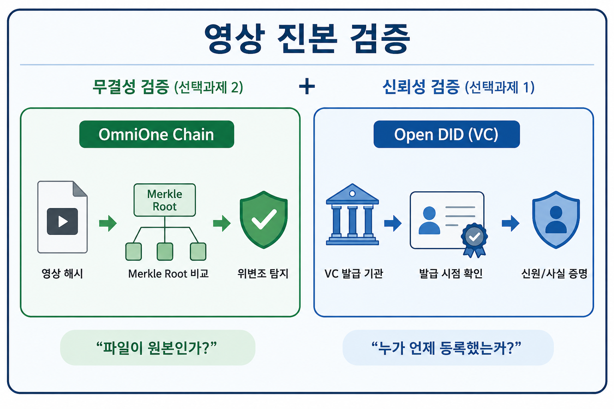

# 진본 (JinBon) Backend

블록체인 기반 영상 진본 인증 서비스 백엔드

> 2026 블록체인 & AI 해커톤 - Track 2 (MVP 개발)

## 서비스 개요

**진본**은 영상 콘텐츠의 원본 여부를 블록체인과 DID 기술로 증명하는 플랫폼입니다.
공인(Issuer)이 영상을 등록하면, 해시 기반 무결성 검증과 VC(Verifiable Credential) 기반 신뢰성 검증을 동시에 수행합니다.

## 핵심 프로세스

### 시스템 구성도



### 영상 등록 플로우

```
공인(Issuer) → 진본 백엔드
  │
  ├─ 1. 모바일 신분증 로그인 (OmniOne CX)
  ├─ 2. 영상 업로드
  ├─ 3. 해시 생성
  │     ├─ 지각해시 (DCT 기반 pHash, 프레임별 — 재인코딩 내성)
  │     └─ SHA-256 (전체 파일 — 정확한 동일성 검증)
  ├─ 4. 머클트리 생성 (Merkle Root + Merkle Path)
  │
  ├─ 5. [선택과제 2] OmniOne Chain 기록
  │     → Merkle Root + Issuer DID + Signature → 블록체인 트랜잭션
  │
  ├─ 6. [선택과제 1] Open DID VC 발급
  │     → "이 영상은 진본 플랫폼에서 인증되었다" 증명서 발급
  │
  └─ 7. DB 저장 (영상정보, 해시, Merkle Path, txHash, vcId)
```

### 영상 검증 플로우

```
검증 요청자 (크롬 확장 등) → 진본 백엔드
  │
  ├─ 1. SHA-256 해시 재계산 → 캐시/DB 정확 매칭 시도
  │     ├─ 캐시 HIT → 즉시 반환 (DB/블록체인 조회 생략)
  │     ├─ DB HIT → 블록체인 검증 후 결과 캐싱
  │     └─ MISS ↓
  ├─ 2. 지각해시(pHash) 생성 → 유사도 검색 (재인코딩 영상 대응)
  │     → 프레임별 DCT 기반 pHash, 해밍 거리 < 10 이면 동일 영상 판정
  │
  ├─ 3. [선택과제 2] OmniOne Chain 검증
  │     → 블록체인에서 Merkle Root + Signature 조회
  │     → 서명 재계산 결과와 온체인 데이터 비교 → 무결성 확인
  │
  ├─ 4. [선택과제 1] Open DID VC 검증
  │     → VC의 발급 기관, 발급 시점, 유효성 확인 → 신뢰성 확인
  │
  └─ 5. 진본 판정 + 검증 결과 캐싱 (TTL 10분)
```

## 해커톤 과제별 활용

### 필수과제: 모바일 신분증 (OmniOne CX)

| 항목 | 내용 |
|------|------|
| 용도 | 공인(Issuer) 로그인 및 본인확인 |
| 연동 방식 | OmniOne CX VC-Verifier API |
| 인증 흐름 | QR 스캔 / WebToApp → VP 제출 → 신원 검증 → JWT 발급 |

### 선택과제 1: Open DID

| 항목 | 내용 |
|------|------|
| 용도 | 영상 진본 인증서(VC) 발급 및 검증 |
| 역할 | **"누가, 언제, 이 영상을 등록했는가"** 에 대한 신뢰성 증명 |
| 구성 | Open DID Orchestrator로 TAS, Issuer, Verifier, CA, Wallet, API 서버 일괄 관리 |
| 블록체인 | Hyperledger Besu (로컬 Docker) — DID Document 앵커링용 |
| VC 발급 흐름 | request-offer → inspect-propose → generate-profile → issue-vc → complete-vc |
| 검증 시 | VC 유효성 확인으로 발급 기관/시점/위변조 여부 판별 |

### 선택과제 2: OmniOne Chain

| 항목 | 내용 |
|------|------|
| 용도 | 영상 해시의 블록체인 기록 및 검증 |
| 역할 | **"이 영상이 변조되지 않았는가"** 에 대한 무결성 증명 |
| 체인 | OmniOne Chain (BESU 기반) |
| 연동 방식 | REST API (`test.stage-chainapi.omnione.net`) + API Token 인증 |
| 기록 데이터 | Merkle Root, Issuer DID, Digital Signature |
| 스마트 컨트랙트 | Solidity 기반 JinBon.sol (register / verify / deactivate) |
| 검증 시 | 해시 재계산 → 온체인 Merkle Root 비교 → 무결성 판정 |

### 두 과제의 조합



## 기술 스택

| 구분 | 기술 |
|------|------|
| Language | Java 21 |
| Framework | Spring Boot 4.1.0 |
| Database | PostgreSQL 16.4 |
| Cache | Redis 7 |
| Blockchain | OmniOne Chain (BESU / Solidity) |
| DID | Open DID (Orchestrator + Hyperledger Besu) |
| 모바일 신분증 | OmniOne CX (VC-Verifier) |
| Build | Gradle 8.14 |

## 프로젝트 구조

```
src/main/java/com/jinbon/
├── JinbonApplication.java
├── domain/
│   ├── auth/              # 인증 (OmniOne CX + JWT)
│   │   ├── controller/
│   │   ├── dto/
│   │   └── service/
│   ├── member/            # 회원 관리
│   │   ├── entity/
│   │   └── repository/
│   └── video/             # 영상 등록/검증
│       ├── controller/
│       ├── dto/
│       ├── entity/
│       ├── repository/
│       └── service/
├── global/                # 공통
│   ├── common/            #   응답 포맷
│   ├── config/            #   Security, Redis, JWT Filter
│   └── error/             #   예외 처리
└── infra/                 # 외부 연동
    ├── omnione/           #   OmniOne CX 클라이언트
    ├── opendid/           #   Open DID Issuer 클라이언트 + VC 발급
    ├── blockchain/        #   OmniOne Chain 클라이언트
    └── redis/             #   Redis 캐시
```

## 인프라 구성

```
docker-compose.yml (진본 인프라)
├── jinbon-postgres (5432)    # 진본 백엔드 DB
└── jinbon-redis (6380)       # 검증 캐시

Open DID Orchestrator (localhost:9001)
├── Hyperledger Besu (Docker)  # DID Document 앵커링용 블록체인
├── PostgreSQL (5430)          # Open DID 서버 DB
├── TAS (8090)                 # Trust Agent Server
├── Issuer (8091)              # VC 발급 서버
├── Verifier (8092)            # VC 검증 서버
├── CA (8094)                  # Certificate Authority
├── Wallet (8095)              # 지갑 서버
├── API Gateway (8093)         # API 게이트웨이
└── Demo (8099)                # 데모 서버
```

## 실행 방법

### 1. 진본 인프라 기동

```bash
# PostgreSQL + Redis
docker compose up -d
```

### 2. Open DID Orchestrator 기동

```bash
cd docker/opendid/did-orchestrator-server/source/did-orchestrator-server

# 서버 JAR 다운로드 (최초 1회)
sh download.sh 2.0.0

# 빌드
./gradlew clean build -x test

# 실행
java -jar did-orchestrator-server-2.0.0.jar
```

브라우저에서 `http://localhost:9001` 접속 후:
1. Repository 선택 (Hyperledger Besu)
2. **Generate All** → Wallet/DID Document 생성
3. **Start All** → 전체 서버 기동

### 3. 진본 백엔드 실행

```bash
# 환경변수 설정
cp .env.example .env

# 빌드 & 실행
./gradlew bootRun
```

## API 엔드포인트

| Method | Path | 설명 | 인증 |
|--------|------|------|------|
| POST | `/api/auth/token` | OmniOne CX 토큰 생성 | X |
| POST | `/api/auth/app/request` | WebToApp 인증 요청 (Deep Link 생성) | X |
| POST | `/api/auth/app/verify` | WebToApp 검증 + 로그인 | X |
| POST | `/api/auth/refresh` | JWT 토큰 갱신 | X |
| POST | `/api/auth/logout` | 로그아웃 (Refresh Token 폐기) | X |
| POST | `/api/videos` | 영상 등록 (해시 + 블록체인 + VC) | O (ISSUER) |
| GET | `/api/videos` | 내 영상 목록 조회 | O |
| GET | `/api/videos/{id}` | 영상 상세 조회 | O |
| PATCH | `/api/videos/{id}/deactivate` | 영상 비활성화 | O (ISSUER) |
| POST | `/api/verify` | 영상 진본 검증 (파일 업로드) | X |
| POST | `/api/verify/url` | 영상 진본 검증 (URL 기반, 서버 다운로드 후 전체 분석) | X |
