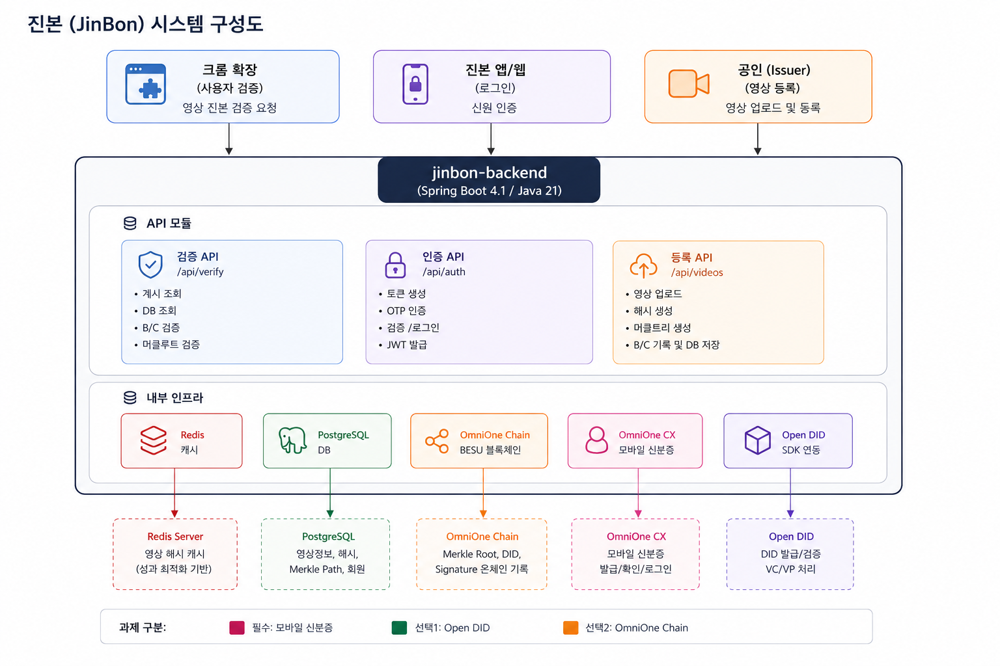

# 진본 (JinBon) Backend

블록체인 기반 영상 진본 인증 서비스 백엔드

> 2026 블록체인 & AI 해커톤 - Track 2 (MVP 개발)

## 기술 스택

| 구분 | 기술 |
|------|------|
| Language | Java 21 |
| Framework | Spring Boot 4.1.0 |
| Database | PostgreSQL |
| Cache | Redis |
| Blockchain | OmniOne Chain (BESU / Solidity) |
| DID | OmniOne Open DID (오픈소스 SDK) |
| 모바일 신분증 | OmniOne CX (VC-Verifier) |
| Build | Gradle 8.14 |

## 시스템 구성도



## 핵심 플로우

### 1. 영상 등록 (공인 → 진본 시스템)

```
공인(Issuer)
  │
  ├─ 1. 모바일 신분증 로그인 (OmniOne CX)
  ├─ 2. 영상 업로드
  ├─ 3. 해시 생성 (거친해시 + 정교한해시)
  ├─ 4. 머클트리 생성 (Merkle Root + Merkle Path)
  ├─ 5. 블록체인 기록 (OmniOne Chain)
  │     → Merkle Root, Issuer DID, Signature, Version
  └─ 6. DB 저장 (빠른 조회용)
        → 영상정보, 해시, Merkle Path, Block Number
```

### 2. 영상 검증 (사용자 → 크롬 확장)

```
사용자 (크롬 확장)
  │
  ├─ 1. 영상 해시 생성 (거친해시 + 정교한해시)
  ├─ 2. 캐시 조회 (정교한해시 기반)
  │     ├─ HIT → ✅ 진본 확인
  │     └─ MISS ↓
  ├─ 3. DB 조회 (정교한해시 비교 + Merkle Path 획득)
  ├─ 4. 블록체인 조회 (Merkle Root + Signature)
  ├─ 5. 검증 수행 (해시 비교 + Merkle Root 재계산)
  └─ 6. ✅ 진본 확인 (+ 캐시 갱신)
```

## 프로젝트 구조

```
src/main/java/com/jinbon/
├── JinbonApplication.java
├── domain/
│   ├── auth/              # 인증 (OmniOne CX + JWT)
│   │   ├── controller/
│   │   ├── dto/
│   │   └── service/
│   ├── member/            # 회원 관리
│   │   ├── entity/
│   │   └── repository/
│   └── video/             # 영상 등록/검증
│       ├── controller/
│       ├── dto/
│       ├── entity/
│       ├── repository/
│       └── service/
├── global/                # 공통
│   ├── common/            #   응답 포맷
│   ├── config/            #   Security, Redis, JWT Filter
│   └── error/             #   예외 처리
└── infra/                 # 외부 연동
    ├── omnione/           #   OmniOne CX 클라이언트
    ├── opendid/           #   Open DID SDK 연동
    ├── blockchain/        #   OmniOne Chain 클라이언트
    └── redis/             #   Redis 캐시
```

## 활용 기술 (해커톤 과제)

| 과제 | 기술 | 활용 |
|------|------|------|
| 필수 | 모바일 신분증 (OmniOne CX) | 공인 로그인 및 본인확인 |
| 선택 1 | Open DID | 공인(Issuer) DID 발급, 영상 VC 발급/검증 |
| 선택 2 | OmniOne Chain | Merkle Root, 서명 등 영상 인증 데이터 온체인 기록 |

## 실행 방법

```bash
# 사전 요구사항: Java 21, PostgreSQL, Redis

# 환경변수 설정
cp .env.example .env

# 빌드
./gradlew build

# 실행
./gradlew bootRun
```

## API 엔드포인트

| Method | Path | 설명 | 인증 |
|--------|------|------|------|
| POST | `/api/auth/token` | OmniOne CX 토큰 생성 | X |
| POST | `/api/auth/qr/request` | QR 인증 요청 | X |
| POST | `/api/auth/qr/verify` | QR 검증 + 로그인 | X |
| POST | `/api/auth/app/verify` | WebToApp 검증 + 로그인 | X |
| POST | `/api/videos` | 영상 등록 | O (ISSUER) |
| POST | `/api/verify` | 영상 진본 검증 | X |
| GET | `/health` | 헬스체크 | X |
