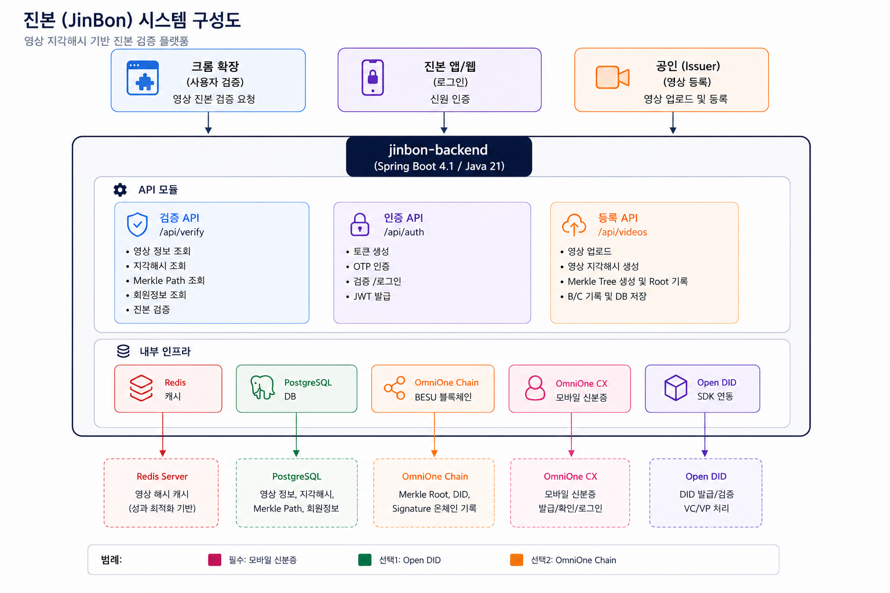
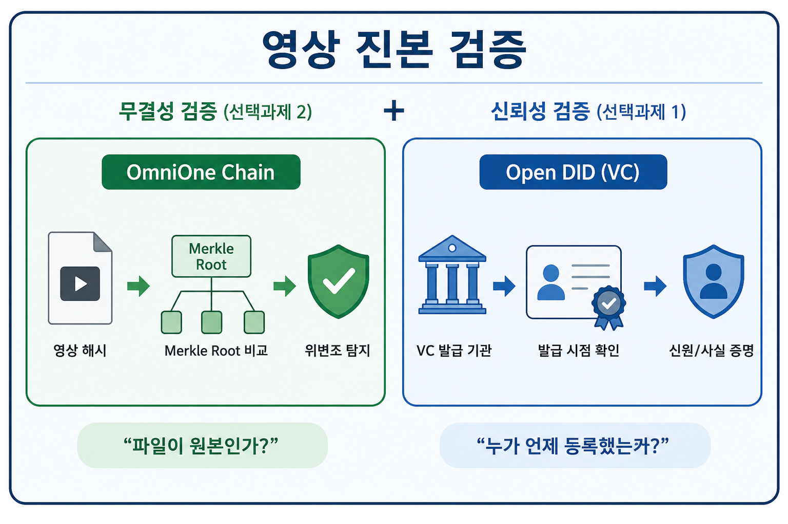

# 진본 (JinBon) Backend

블록체인 기반 영상 진본 인증 서비스 백엔드

> 2026 블록체인 & AI 해커톤 - Track 2 (MVP 개발)

## 적용 전 필수 작업

다음 항목은 코드에는 반영되었지만 배포 환경에는 별도 적용이 필요합니다.

- [ ] `contracts/JinBon.sol` 신규 배포
  - 접근 제어와 온체인 signature 조회가 추가되어 기존 컨트랙트 ABI와 호환되지 않습니다.
  - 배포 완료 후 `.env`의 `CONTRACT_ADDRESS`를 새 주소로 변경해야 합니다.
- [ ] 백엔드 블록체인 지갑 확인
  - `register`와 `deactivate`는 컨트랙트 배포 지갑만 호출할 수 있습니다.
  - `WALLET_ADDRESS`와 `src/main/resources/keystore/omnione-chain-keystore.json`은 컨트랙트를 배포한 동일 지갑이어야 합니다.
- [ ] VC 완료 API 호출부 수정
  - `POST /api/videos/{id}/vc/complete` 요청에 영상 등록 응답으로 받은 `offerId`를 함께 전달해야 합니다.

```json
{
  "vcId": "vc-abc123",
  "offerId": "offer-abc123"
}
```

## 서비스 개요

**진본**은 영상 콘텐츠의 원본 여부를 블록체인과 DID 기술로 증명하는 플랫폼입니다.
공인(Issuer)이 영상을 등록하면 해시와 블록체인으로 영상 무결성을 기록하고, 사용자가 Wallet에서 VC(Verifiable Credential)를 발급받아 등록 사실을 증명할 수 있습니다.

## 핵심 프로세스

### 시스템 구성도



### 영상 등록 플로우

```
공인(Issuer) → 진본 백엔드
  │
  ├─ 1. 모바일 신분증 로그인 (OmniOne CX)
  ├─ 2. 영상 업로드
  ├─ 3. SHA-256 (fineHash) 생성 → 중복 영상 확인
  ├─ 4. 지각해시 (DCT 기반 pHash, 프레임별 — 재인코딩 내성) 생성
  ├─ 5. 두 해시의 결합 SHA-256 생성 (Merkle Root 필드) + 서버 HMAC 서명
  │
  ├─ 6. [선택과제 2] OmniOne Chain 기록
  │     → Merkle Root + Issuer DID + Signature → 블록체인 트랜잭션
  │
  ├─ 7. DB 저장 (영상정보, 해시, Merkle Path, txHash)
  │
  └─ 8. [선택과제 1] Open DID VC 발급 준비
        → 서버가 Holder DID와 영상 Claim을 Issuer에 등록하고 발급 Offer 생성
        → 앱이 Wallet 프로토콜로 사용자 동의·PIN 인증 후 VC 수령 및 저장
        → 발급 완료 API로 vcId를 서버 영상 정보에 연결
```

영상 등록과 VC 발급은 별도 단계입니다. 영상의 블록체인 등록이 완료되면 VC 발급을 취소하거나 일시적으로 실패해도 영상 등록 결과는 유지되며, 이후 Wallet에서 다시 발급받을 수 있습니다.

### 회원가입 / 로그인 플로우

회원가입과 로그인은 명확히 분리됩니다. 로그인 과정에서는 회원을 자동 생성하지 않습니다.

```
회원가입: 모바일 신분증 인증 → PENDING 회원 생성 → Wallet/DID 생성
        → DID Document 등록 → 서버 DID 연결 → ACTIVE 전환 → JWT 발급

로그인:   모바일 신분증 인증 → CI로 ACTIVE 회원 조회 → JWT 발급
        (미가입: 거부 / PENDING: 가입 완료 안내)
```

CI 원문은 저장하지 않습니다. 인증 직후 서버 전용 비밀키로 `HMAC-SHA256` 처리한 식별자만 회원 중복 확인·로그인·DID 복구에 사용하며, VC·DID Document·블록체인에는 포함하지 않습니다. `CI_HMAC_SECRET`은 32자 이상의 고정값으로 별도 보관하고 변경 또는 분실하지 않아야 합니다.

### 영상 검증 플로우

```
검증 요청자 (크롬 확장 등) → 진본 백엔드
  │
  ├─ 1. SHA-256 해시 재계산 → 캐시/DB 정확 매칭 시도
  │     ├─ 캐시 HIT → 즉시 반환 (DB/블록체인 조회 생략)
  │     ├─ DB HIT → 블록체인 검증 후 결과 캐싱
  │     └─ MISS ↓
  ├─ 2. 지각해시(pHash) 생성 → 유사도 검색 (재인코딩 영상 대응)
  │     → 프레임별 DCT 기반 pHash, 해밍 거리 < 10 이면 동일 영상 판정
  │
  ├─ 3. [선택과제 2] OmniOne Chain 검증
  │     → Merkle Root로 온체인 Issuer DID + Signature 조회
  │     → 서명 재계산 결과와 온체인 데이터 비교 → 무결성 확인
  │
  ├─ 4. [선택과제 1] Open DID VC 검증
  │     → VC의 발급 기관, 발급 시점, 유효성 확인 → 신뢰성 확인
  │
  └─ 5. 진본 판정 + 검증 결과 캐싱 (TTL 10분)
```

## 해커톤 과제별 활용

### 필수과제: 모바일 신분증 (OmniOne CX)

| 항목 | 내용 |
|------|------|
| 용도 | 공인(Issuer) 로그인 및 본인확인 |
| 연동 방식 | OmniOne CX OACX API (trans / authen/app) |
| 인증 흐름 | WebToApp (token 발급 → 딥링크 생성 → 앱 호출) → OmniOne CX 신원 검증 → CI 기반 회원 처리 → JWT 발급 |

### 선택과제 1: Open DID

| 항목 | 내용 |
|------|------|
| 용도 | 영상 진본 인증서(VC) 발급 및 검증 |
| 역할 | **"누가, 언제, 이 영상을 등록했는가"** 에 대한 신뢰성 증명 |
| 구성 | Open DID Orchestrator로 TAS, Issuer, Verifier, CA, Wallet, API 서버 일괄 관리 |
| 블록체인 | Hyperledger Besu (로컬 Docker) — DID Document 앵커링용 |
| VC 발급 흐름 | 백엔드가 Holder/Claim 등록 및 발급 Offer 생성 → 앱 Wallet이 offerId로 사용자 동의·PIN 인증 → issue-vc → confirm → 로컬 저장 → 백엔드에 vcId 연결 |
| 검증 시 | VC 상태(ACTIVE)와 Verifier의 서명·무결성 검증 결과 확인 |

### 선택과제 2: OmniOne Chain

| 항목 | 내용 |
|------|------|
| 용도 | 영상 해시의 블록체인 기록 및 검증 |
| 역할 | **"이 영상이 변조되지 않았는가"** 에 대한 무결성 증명 |
| 체인 | OmniOne Chain (BESU 기반) |
| 연동 방식 | REST API (`test.stage-chainapi.omnione.net`) + API Token 인증 |
| 기록 데이터 | Merkle Root, Issuer DID, Digital Signature |
| 스마트 컨트랙트 | Solidity 기반 JinBon.sol (register / getRecord / deactivate), 배포 지갑만 변경 가능 |
| 검증 시 | 해시 재계산 → 온체인 Merkle Root 비교 → 무결성 판정 |

### 두 과제의 조합



## 기술 스택

| 구분 | 기술 |
|------|------|
| Language | Java 21 |
| Framework | Spring Boot 4.1.0 |
| Database | PostgreSQL 16.4 |
| Cache | Redis 7 |
| Blockchain | OmniOne Chain (BESU / Solidity) |
| DID | Open DID (Orchestrator + Hyperledger Besu) |
| 모바일 신분증 | OmniOne CX (VC-Verifier) |
| Build | Gradle 8.14 |

## 프로젝트 구조

```
src/main/java/com/jinbon/
├── JinbonApplication.java
├── domain/
│   ├── auth/              # 인증 (OmniOne CX + JWT)
│   │   ├── controller/
│   │   ├── dto/
│   │   └── service/
│   ├── member/            # 회원 관리
│   │   ├── entity/
│   │   └── repository/
│   └── video/             # 영상 등록/검증
│       ├── controller/
│       ├── dto/
│       ├── entity/
│       ├── repository/
│       └── service/
├── global/                # 공통
│   ├── common/            #   응답 포맷
│   ├── config/            #   Security, Redis, JWT Filter
│   └── error/             #   예외 처리
└── infra/                 # 외부 연동
    ├── omnione/           #   OmniOne CX 클라이언트
    ├── opendid/           #   Open DID Issuer 연동 + Wallet VC 발급 준비/검증
    └── blockchain/        #   OmniOne Chain 클라이언트
```

## 인프라 구성

```
docker-compose.yml (진본 인프라)
├── jinbon-postgres (5432)    # 진본 백엔드 DB
└── jinbon-redis (6380)       # 검증 캐시

Open DID Orchestrator (localhost:9001)
├── Hyperledger Besu (Docker)  # DID Document 앵커링용 블록체인
├── PostgreSQL (5430)          # Open DID 서버 DB
├── TAS (8090)                 # Trust Agent Server
├── Issuer (8091)              # VC 발급 서버
├── Verifier (8092)            # VC 검증 서버
├── CA (8094)                  # Certificate Authority
├── Wallet (8095)              # 지갑 서버
├── API Gateway (8093)         # API 게이트웨이
└── Demo (8099)                # 데모 서버
```

## 실행 방법

### 사전 요구사항

- JDK 21
- Docker 및 Docker Compose
- URL 영상 검증을 사용할 경우 `yt-dlp`
- 별도로 설치한 Open DID Orchestrator 2.0.0
- 배포된 `JinBon.sol` 컨트랙트와 배포 지갑 keystore

### 1. 진본 인프라 기동

```bash
# PostgreSQL + Redis
docker compose up -d
```

### 2. Open DID Orchestrator 기동 (별도 저장소)

```bash
cd /path/to/did-orchestrator-server

# 서버 JAR 다운로드 (최초 1회)
sh download.sh 2.0.0

# 빌드
./gradlew clean build -x test

# 실행
java -jar did-orchestrator-server-2.0.0.jar
```

브라우저에서 `http://localhost:9001` 접속 후:
1. Repository 선택 (Hyperledger Besu)
2. **Generate All** → Wallet/DID Document 생성
3. **Start All** → 전체 서버 기동

Open DID를 사용하지 않을 때는 `.env`에서 `OPENDID_ENABLED=false`로 설정합니다.
이 경우 영상 등록은 가능하지만 VC 준비·완료·검증은 수행되지 않으며 `vcVerified`는 `false`입니다.

### 3. 진본 백엔드 실행

```bash
# 환경변수 설정
cp .env.example .env

# contracts/JinBon.sol을 배포한 뒤 CONTRACT_ADDRESS를 설정하고,
# 배포에 사용한 지갑 keystore를 아래 경로에 둡니다.
# src/main/resources/keystore/omnione-chain-keystore.json

# 빌드 & 실행
./gradlew bootRun
```

## API 엔드포인트

| Method | Path | 설명 | 인증 |
|--------|------|------|------|
| POST | `/api/auth/token` | OmniOne CX 토큰 생성 | X |
| POST | `/api/auth/app/request` | WebToApp 인증 요청 (Deep Link 생성) | X |
| POST | `/api/auth/app/verify` | WebToApp 검증 + 로그인 | X |
| POST | `/api/auth/did/rebind` | 앱 재설치 후 Wallet DID 재연결 | X (재연결 토큰) |
| POST | `/api/auth/refresh` | JWT 토큰 갱신 | X |
| POST | `/api/auth/logout` | 로그아웃 (Refresh Token 폐기) | X |
| POST | `/api/signup/token` | 회원가입용 OmniOne CX 토큰 생성 | X |
| POST | `/api/signup/app/request` | 회원가입용 WebToApp 인증 요청 | X |
| POST | `/api/signup/app/verify` | 본인확인 + PENDING 회원 생성 | X |
| POST | `/api/signup/did/complete` | DID 연결 + 회원가입 완료 + JWT 발급 | X (가입 토큰) |
| POST | `/api/videos` | 영상 등록 (해시 + 블록체인) 및 Wallet VC 발급 준비 | O (ISSUER) |
| POST | `/api/videos/{id}/vc/complete` | Wallet VC 발급 완료 후 `vcId`와 등록 응답의 `offerId` 연결 | O (ISSUER, 본인 영상) |
| GET | `/api/videos` | 내 영상 목록 조회 | O |
| GET | `/api/videos/{id}` | 영상 상세 조회 | O |
| PATCH | `/api/videos/{id}/deactivate` | 영상 비활성화 | O (ISSUER) |
| POST | `/api/verify` | 영상 진본 검증 (파일 업로드) | X |
| POST | `/api/verify/url` | 영상 진본 검증 (URL 기반, 서버 다운로드 후 전체 분석) | X |

### 영상 검증 판정

검증 API는 `authentic` boolean과 함께 다음 `verdict`를 반환합니다. `authentic`은 기존
클라이언트 호환을 위해 유지하며, 신규 클라이언트는 `verdict`를 기준으로 화면을 구성해야 합니다.

| verdict | 의미 |
|---------|------|
| `EXACT_MATCH` | 등록된 원본 파일과 SHA-256이 정확히 일치 |
| `SIMILAR_MATCH` | 지각해시가 유사하며 재인코딩 또는 일부 변환 가능 |
| `REGISTERED_BUT_REVOKED` | 등록 기록은 있으나 이후 비활성화됨 |
| `NOT_REGISTERED` | 일치하거나 유사한 등록 기록을 찾지 못함 |
| `VERIFICATION_UNAVAILABLE` | 블록체인 또는 VC 외부 검증 장애, 혹은 등록 무결성을 확인할 수 없는 상태 |

`NOT_REGISTERED`는 해당 영상이 조작되었다는 의미가 아닙니다. 등록 이력이 없다는 의미만
가지며 응답의 `notice`에도 같은 안내가 포함됩니다. `SIMILAR_MATCH` 응답에는
`similarityDistance`가 포함됩니다.

```json
{
  "verdict": "NOT_REGISTERED",
  "similarityDistance": null,
  "authentic": false,
  "videoId": null,
  "issuerDid": null,
  "registeredAt": null,
  "blockchainVerified": false,
  "vcVerified": false,
  "active": false,
  "message": "진본에 등록된 기록을 찾지 못했습니다.",
  "notice": "미등록은 영상이 조작되었다는 의미가 아닙니다."
}
```

`VERIFICATION_UNAVAILABLE` 결과는 장애 복구 후 즉시 다시 확인할 수 있도록 검증 캐시에
저장하지 않습니다.

### 영상 VC 발급 상태

| 상태 | 의미 |
|------|------|
| `NOT_REQUESTED` | VC 발급을 아직 준비하지 않았거나 준비에 실패한 상태 |
| `PENDING_WALLET` | 서버 준비가 끝나 Wallet에서 사용자 발급을 기다리는 상태 |
| `ISSUED` | Wallet 발급이 완료되어 vcId가 영상에 연결된 상태 |

VC 완료 요청의 `offerId`는 해당 영상의 가장 최근 VC 발급 준비 응답에 포함된 값과 일치해야 합니다.

## 블록체인 배포 주의사항

`JinBon.sol`의 `register`와 `deactivate`는 컨트랙트를 배포한 지갑만 호출할 수 있습니다.
백엔드의 `WALLET_ADDRESS`와 keystore는 이 배포 지갑을 사용해야 합니다. 컨트랙트 조회 ABI에
signature가 추가되어 이전 버전 컨트랙트와 호환되지 않으므로, 기존 배포본을 사용하는 환경은
새 컨트랙트를 배포하고 `CONTRACT_ADDRESS`를 갱신해야 합니다.
