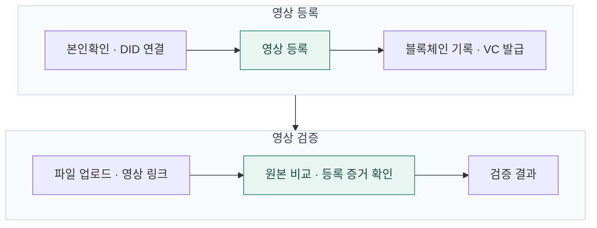

# 진본 (JinBon) Backend

**이 영상이 등록된 원본과 같은지, 누가 등록했는지 확인합니다.**

모바일 신분증으로 본인확인한 등록자의 영상을 기록하고, 파일이나 링크로 받은 영상을 원본과 비교합니다. 블록체인 기록과 VC(검증 가능한 자격증명)로 등록 증거를 확인합니다.

[동작 방식](#동작-방식) · [시작하기](#시작하기) · [API 사용](#api-사용) · [검증 결과](#검증-결과)

## 동작 방식


```mermaid
flowchart TB
    subgraph registration["영상 등록"]
        direction LR
        A["본인확인 · DID 연결"] --> B["영상 등록"]
        B --> C["블록체인 기록 · VC 발급"]
    end
    subgraph verification["영상 검증"]
        direction LR
        D["파일 업로드 · 영상 링크"] --> E["원본 비교 · 등록 증거 확인"]
        E --> F["검증 결과"]
    end
    registration --> verification
    classDef accent fill:#e7f4ef,stroke:#23856d,color:#174c3f
    class B,E accent
    style registration fill:#f8fafc,stroke:#cbd5e1,color:#334155
    style verification fill:#f8fafc,stroke:#cbd5e1,color:#334155
```

- **등록:** 본인확인과 Wallet DID(분산식별자) 연결 후 영상을 등록하고, Wallet에서 VC 보증서를 발급받습니다.
- **비교:** 파일 해시로 정확한 일치를 확인합니다. 재압축된 영상은 영상·음성 구간을 함께 비교합니다.
- **확인:** 원본 비교와 블록체인·VC 검증을 모두 통과해야 진본으로 판정합니다. 웹·앱·브라우저 확장과 카카오톡에서 검증 API를 사용할 수 있습니다.

영상 등록과 VC 발급은 별도 단계입니다. 보증서 발급을 취소하거나 실패해도 영상 등록은 유지되며, 나중에 다시 발급받을 수 있습니다.

진본은 등록 원본과의 비교 및 등록 사실을 확인합니다. 영상 내용의 사실 여부, 저작권, 등록자의 기관 소속·공식 발행 권한을 보증하지 않습니다.

## 시작하기

### 준비 사항

- **JDK 21**, **Docker 및 Docker Compose**
- URL·카카오톡 검증 사용 시 **yt-dlp와 FFmpeg** — `yt-dlp`, `ffmpeg`, `ffprobe`를 서버의 `PATH`에 설치합니다. YouTube용 추가 의존성은 [yt-dlp 안내](https://github.com/yt-dlp/yt-dlp#dependencies)를 따릅니다.
- 본인확인·영상 등록·VC 발급을 위한 외부 서비스 접속 정보

### 1. 환경변수 설정

저장소 루트에서 실행합니다. 기존 `.env`가 있으면 유지합니다.

```bash
cp -n .env.example .env
```

[.env.example](.env.example)을 기준으로 `.env`를 채웁니다. 실행 시 자동으로 읽습니다.

| 설정 | 입력 내용 |
| --- | --- |
| `DB_PASSWORD` | 로컬 PostgreSQL 비밀번호. 나머지 DB 설정은 예제의 기본값 사용 가능 |
| `JWT_SECRET` | JWT·영상 등록 서명용 비밀키. 32바이트 이상의 임의 문자열 |
| `CI_HMAC_SECRET` | 본인확인 식별자(CI) 보호용 비밀키. `JWT_SECRET`과 다른 32자 이상의 임의 문자열 |
| `OPENDID_ENABLED` | VC 기능 사용 시 `true`. 예제의 기본값은 `false` |

두 비밀키는 기존 회원 식별과 영상 검증에 사용되므로 유지·보관해야 합니다. CI 원문은 저장하지 않으며, `.env`와 keystore는 Git에 포함하지 않습니다.

### 2. 인프라와 외부 서비스 준비

```bash
docker compose up -d
```

PostgreSQL(`5432`)과 Redis(`6380`)이 실행됩니다. 아래 외부 서비스는 별도로 준비합니다.

| 서비스 | 역할 | 설정 |
| --- | --- | --- |
| OmniOne CX | 모바일 신분증 본인확인 | `OMNIONE_CX_URL`에 API 서버 주소 지정 |
| OmniOne Chain | 영상 등록 기록 저장·조회 | `BLOCKCHAIN_RPC_URL`, `BLOCKCHAIN_API_TOKEN`, `BLOCKCHAIN_NETWORK`, `BLOCKCHAIN_CHAIN_ID`, `CONTRACT_ADDRESS` 설정 |
| Open DID 2.0.0 | Wallet DID·VC 발급·검증 | TAS·Issuer·Wallet 준비, `OPENDID_ENABLED=true`, `OPENDID_VC_CLAIM_NAMESPACE` 설정 |

**블록체인 지갑:** [JinBon.sol](contracts/JinBon.sol)을 배포하고, 배포 지갑의 `WALLET_ADDRESS`와 `KEYSTORE_PASSWORD`를 설정합니다. 같은 지갑의 keystore를 `src/main/resources/keystore/omnione-chain-keystore.json`에 둡니다. 등록·비활성화는 배포 지갑만 실행할 수 있습니다.

**VC 발급 설정:** [Open DID Orchestrator](https://github.com/OmniOneID/did-orchestrator-server)에서 서버를 준비하고, Issuer에 진본용 VC 스키마·발급 정책을 등록합니다. [application.yml](src/main/resources/application.yml)의 TAS(`8090`)·Issuer(`8091`) 주소, 발급 정책(`vcplan-jinbon-01`), claim namespace(`ns-jinbon-video-01`)를 실제 설정과 맞춥니다. `.env.example`의 namespace는 비어 있으므로 값을 채워야 합니다.

`OPENDID_ENABLED=false`는 VC 기능만 끕니다. 영상 등록에는 블록체인 연결이 필요하며, VC 검증 없이는 진본 판정을 반환하지 않습니다.

### 3. 백엔드 실행

```bash
./gradlew bootRun
```

기본 주소는 `http://localhost:8070`입니다. `SERVER_PORT`로 변경할 수 있습니다.

- [Swagger UI](http://localhost:8070/swagger-ui/index.html) — API 요청·응답 문서. 기본·`dev` 프로파일에서 인증 없이 접근
- [모바일 신분증 인증 화면](http://localhost:8070/auth.html)

## API 사용

영상 등록·관리는 `Authorization: Bearer <accessToken>`이 필요합니다. **회원가입 완료 후 로그인은 별도로 진행**합니다. 영상 검증 API는 로그인 없이 사용할 수 있습니다.

| 메서드 | 경로 | 용도 |
| --- | --- | --- |
| `POST` | `/api/videos` | 영상 등록 (`file`, `title`), ISSUER 권한 필요 |
| `GET` | `/api/videos` | 내 영상 목록 조회 |
| `POST` | `/api/videos/{videoId}/vc/prepare` | 등록 영상의 VC 발급 준비·재시도 |
| `POST` | `/api/videos/{videoId}/vc/complete` | Wallet에서 발급받은 VC 연결 |
| `POST` | `/api/verify` | 파일 검증 (`file`, 최대 100MB) |
| `POST` | `/api/verify/url` | 영상 링크 검증 (`url`) |
| `POST` | `/api/kakao/skill/verify` | 카카오톡 영상 링크 검증 |

회원가입·로그인, 프로필, 영상 상세·비활성화 등 전체 API는 Swagger UI에서 확인합니다. VC 연결 시에는 `vcId`, 발급 준비 응답의 `offerId`, 서명이 포함된 VC JSON 문자열 `credential`을 전달합니다.

```bash
# 파일 검증
curl -X POST http://localhost:8070/api/verify \
  -F 'file=@video.mp4'

# URL 검증 — 실제 영상 URL로 변경
curl -X POST http://localhost:8070/api/verify/url \
  -H 'Content-Type: application/json' \
  -d '{"url":"https://www.youtube.com/watch?v=VIDEO_ID"}'
```

URL은 HTTPS만 허용하며 YouTube, Instagram, TikTok, X(Twitter), Vimeo를 대상으로 합니다. 플랫폼의 접근 제한에 따라 다운로드가 실패할 수 있습니다.

## 검증 결과

응답의 `data.authentic`가 최종 인증 여부입니다. 파일이 정확히 일치하거나 영상·음성 비교 기준을 통과하고, 활성 등록 기록과 블록체인·VC 증거가 유효할 때만 `true`입니다.

구간 비교는 **영상 커버리지 95% 이상·음성 커버리지 100%**와 순서 보존, 영상·음성이 원본의 같은 시간 위치에 대응할 것을 요구합니다. 커버리지는 비교 구간의 일치 비율이며 탐지 정확도가 아닙니다.

| `displayStatus` | 의미 |
| --- | --- |
| `AUTHENTICATED` | 원본 비교와 등록 증거 검증을 모두 통과 |
| `CONTENT_SIMILAR` | 유사 후보는 있지만 비교 기준 미달 또는 정보 부족 |
| `NOT_AUTHENTICATED` | 미등록, 등록 비활성화, VC 미발급·무효 |
| `UNAVAILABLE` | 외부 검증 장애 또는 블록체인 무결성 확인 실패 |

**미등록은 영상이 조작되었다는 뜻이 아닙니다.** 세부 판정은 `verdict`, 등록 증거는 `blockchainVerified`·`vcVerified`·`vcClaimsBound`로 확인합니다. 비교 기준은 [VideoContentMatchService](src/main/java/com/jinbon/domain/video/service/VideoContentMatchService.java)에 정의되어 있습니다.

## 개발

Java 21 · Spring Boot 4.1.0 · PostgreSQL 16.4 · Redis 7 · JavaCV / FFmpeg · Gradle 8.14

```bash
./gradlew test       # 테스트
./gradlew bootJar    # 실행 가능한 JAR 생성
```

코드는 [domain](src/main/java/com/jinbon/domain)(인증·회원·영상·카카오), [infra](src/main/java/com/jinbon/infra)(외부 서비스 연동), [global](src/main/java/com/jinbon/global)(설정·공통 처리)로 구성됩니다.

배포 시 `SPRING_PROFILES_ACTIVE=prod`와 `CORS_ALLOWED_ORIGINS`를 설정합니다. 허용 주소에는 웹 클라이언트와 백엔드 자신의 공개 주소를 포함합니다. `prod`는 기존 DB 스키마를 검증하므로 먼저 스키마를 준비해야 합니다. 상세 설정은 [application-prod.yml](src/main/resources/application-prod.yml)을 확인합니다.
